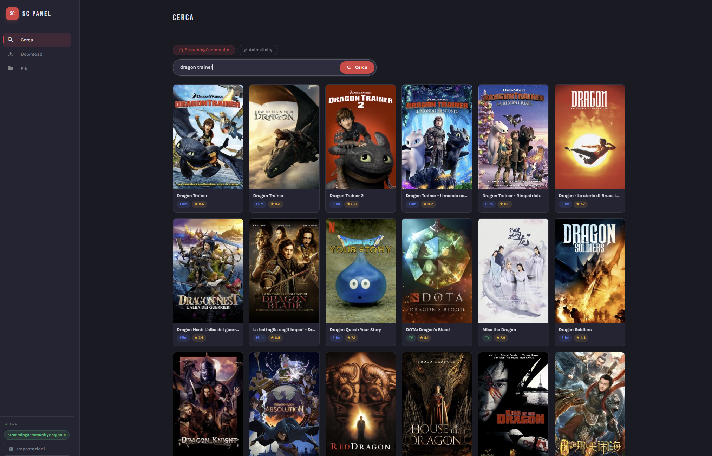
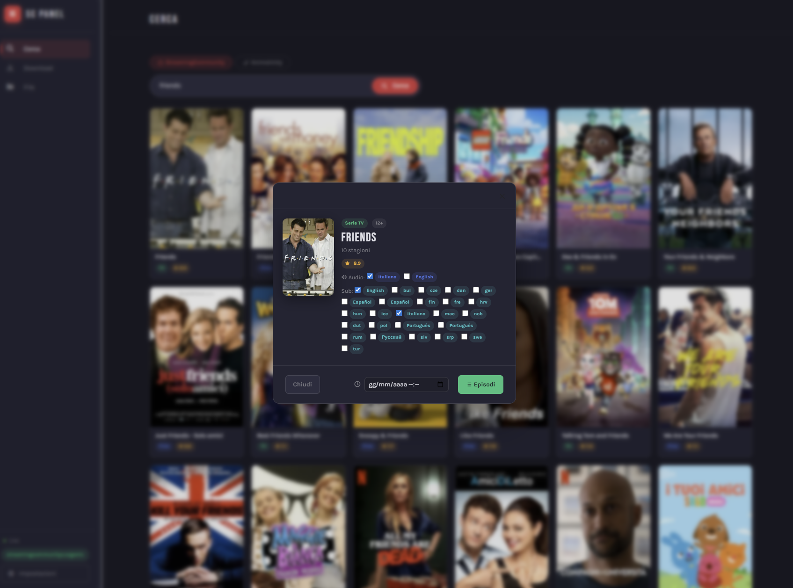
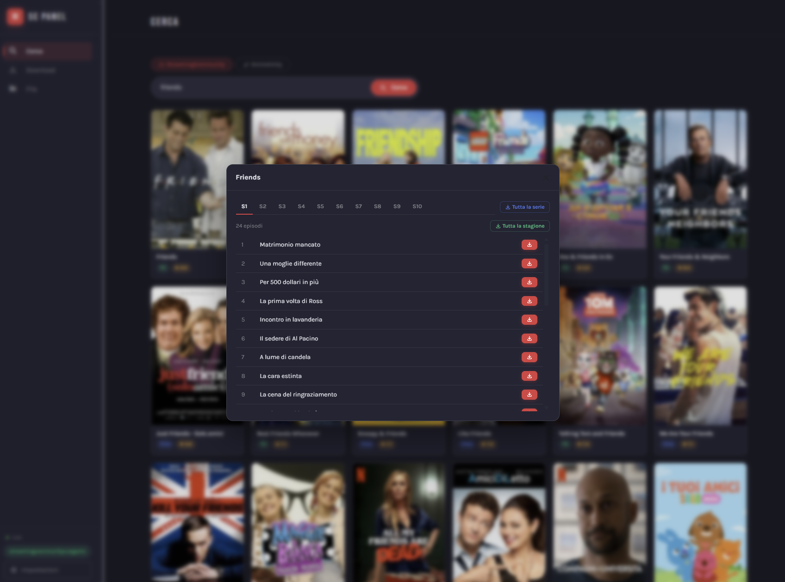
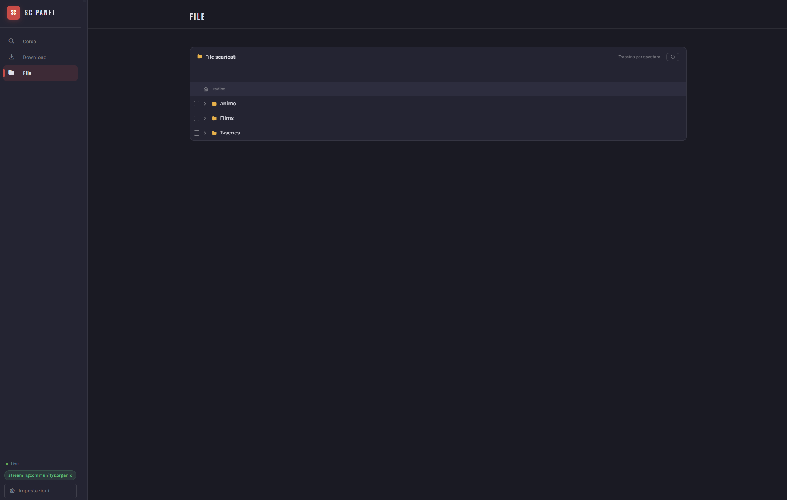
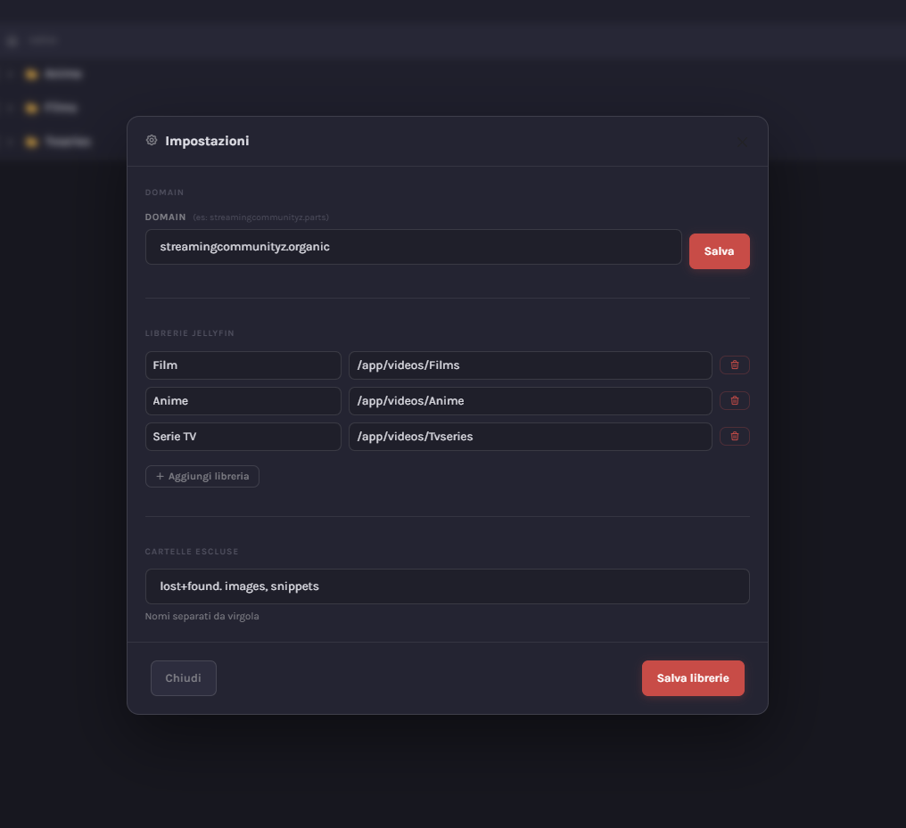

<p align="center">
  
</p>

<p align="center">
  A self-hosted web panel to download films and TV series from the StreamingCommunity platform.<br/>
  Built with FastAPI, real-time progress via SSE, and an integrated file manager.
</p>

---

## Screenshots

<table>
  <tr>
    <td></td>
    <td></td>
  </tr>
  <tr>
    <td></td>
    <td></td>
  </tr>
  <tr>
    <td colspan="2"></td>
  </tr>
</table>

---

## Features

- Search and download films, TV series, and anime
- Automatic quality selection (1080p → 720p → 480p → 360p)
- Parallel HLS segment download with AES-CBC decryption
- Multi-audio track merge via FFmpeg
- Subtitle download (`.vtt`) for non-Italian audio tracks
- Real-time download progress with per-phase steps (video → audio → merge)
- Integrated file manager with drag-and-drop and video streaming
- Jellyfin library path configuration
- Scheduled downloads
- Docker ready

---

## Quick Start

### Docker (recommended)

```bash
curl -O https://raw.githubusercontent.com/EdoardoFiore/StreamingCommunity-downloader/main/docker-compose.template.yml
# Edit the volume paths, then:
docker compose -f docker-compose.template.yml up -d
```

The panel is available at `http://localhost:8000`.

The image is published to GitHub Container Registry on every push to `main`:

```
ghcr.io/edoardofiore/streamingcommunity-downloader:latest
```

### From source

```bash
git clone https://github.com/EdoardoFiore/StreamingCommunity-downloader.git
cd StreamingCommunity-downloader
pip install -r requirements.txt
python main.py
```

**Prerequisites:** Python ≥ 3.11, FFmpeg (auto-installed on first run).

---

## Configuration

| Variable | Default | Description |
|---|---|---|
| `HOST` | `127.0.0.1` | Bind address |
| `PORT` | `8000` | Bind port |
| `VIDEOS_DIR` | `videos/` | Output directory |
| `DATA_FILE` | `data.json` | Domain + library config |
| `TMP_DIR` | `tmp/` | Temp directory for segments |

The StreamingCommunity domain and Jellyfin library paths are configurable from the **Settings** panel in the UI.

---

## Output structure

```
videos/
├── MovieTitle/
|    └── MovieTitle.mp4
└── SeriesTitle/
    └── Season 01
        ├── S01E01.mp4
        └── S01E02.mp4
```

---

## License

MIT
