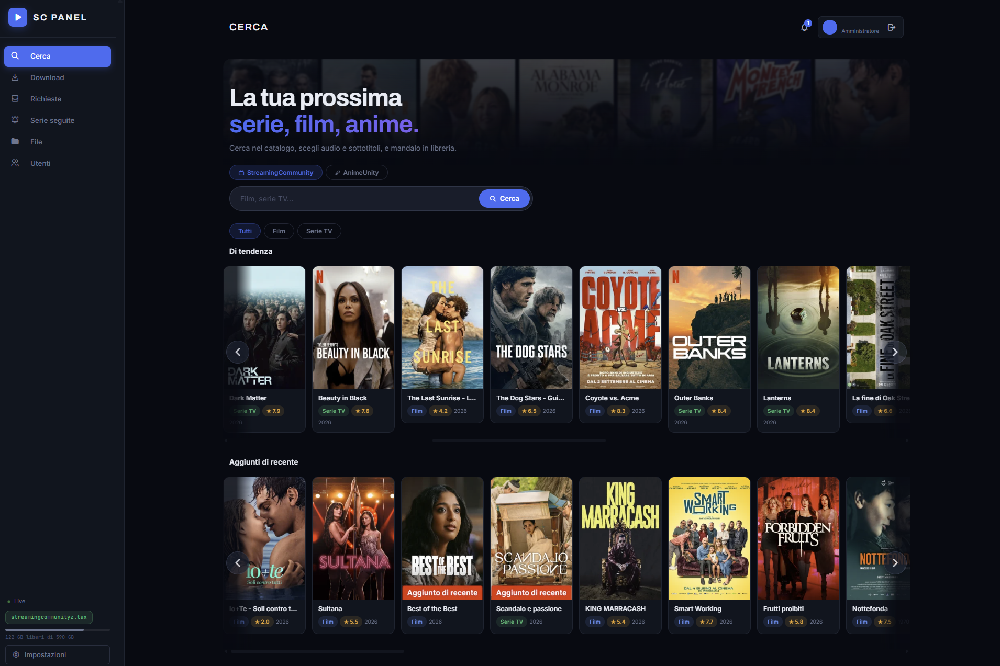
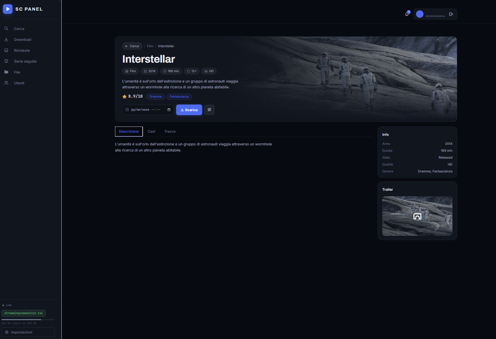
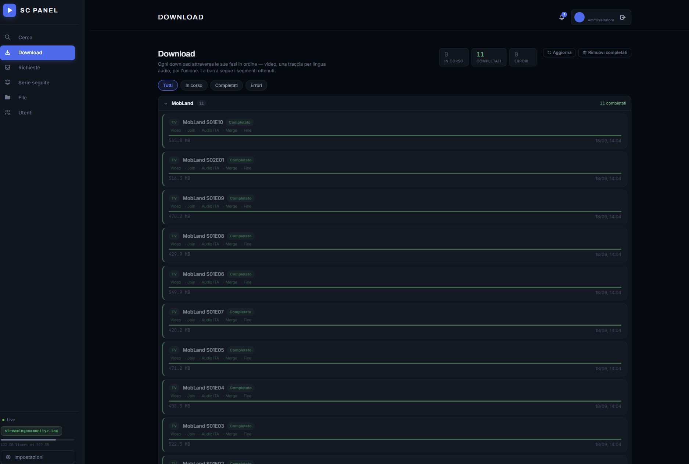
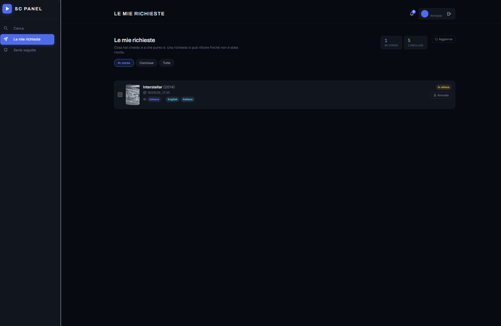
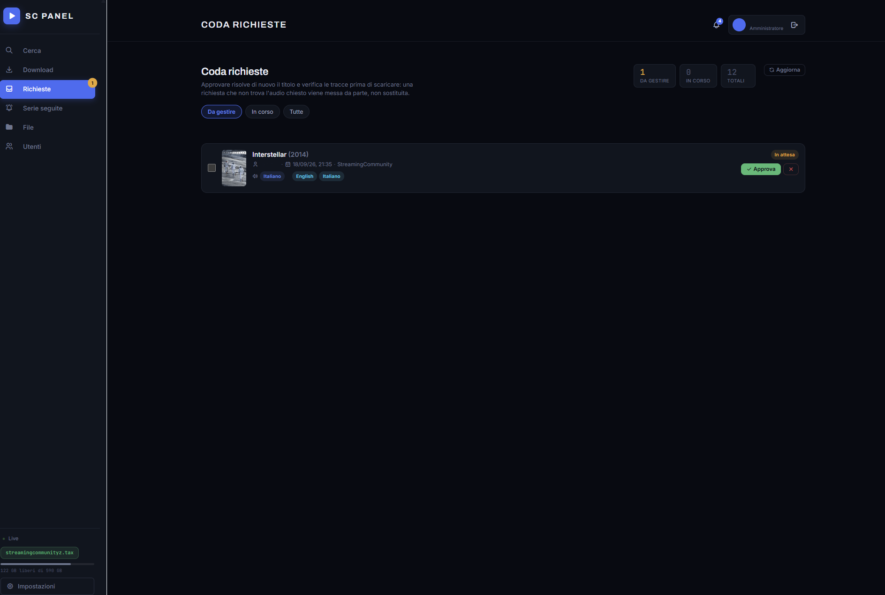
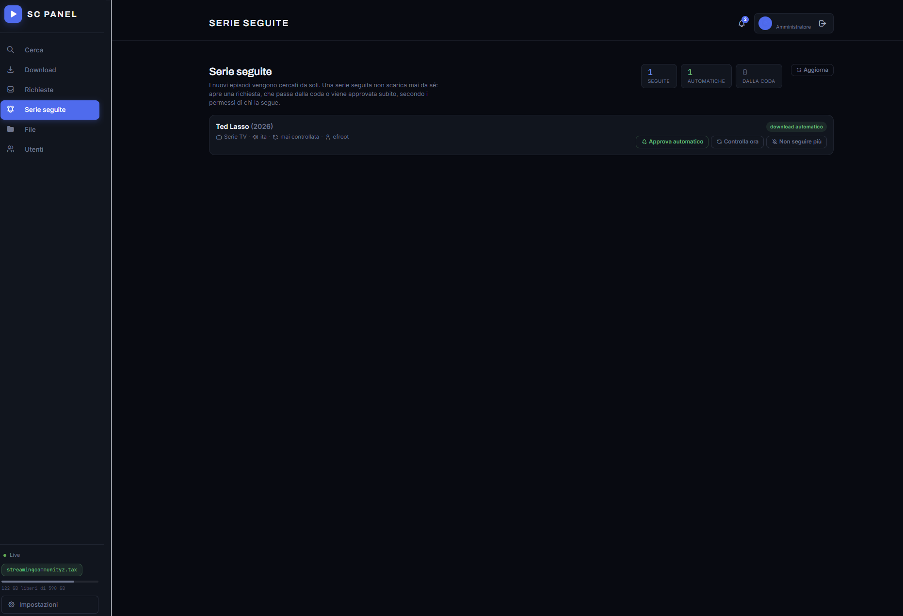
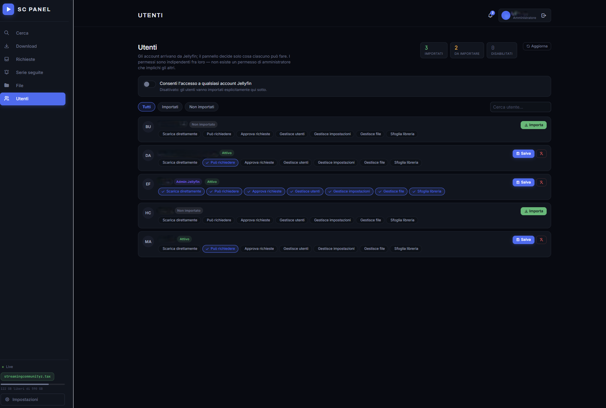
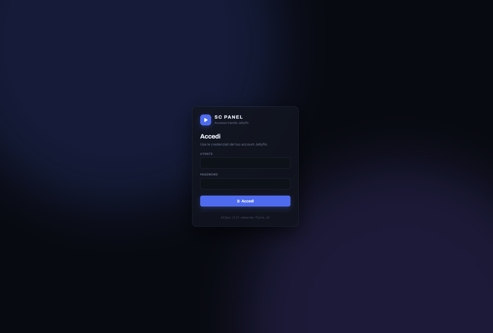

<p align="center">
  
</p>

<p align="center">
  A self-hosted web panel to download films, TV series and anime into a Jellyfin library.<br/>
  Request queue, followed series, notifications to Discord and Telegram, and an integrated
  file manager.
</p>

---

## Screenshots

<p align="center">
  
</p>
<p align="center">
  <sub><b>The start page</b> — the source's own shelves, browsable before you have searched for
  anything.</sub>
</p>

### Finding something

<table>
  <tr>
    <td width="50%" valign="top">
      <br/>
      <sub><b>Search</b> — films, series and anime across both sources, with the state of each
      title readable on the card.</sub>
    </td>
    <td width="50%" valign="top">
      <br/>
      <sub><b>Film page</b> — plot, genres, rating, artwork and trailer, taken from the title page
      itself. No API key involved.</sub>
    </td>
  </tr>
  <tr>
    <td width="50%" valign="top">
      <br/>
      <sub><b>Series page</b> — seasons and episodes, with the audio and subtitle tracks each one
      actually offers.</sub>
    </td>
    <td width="50%" valign="top">
      <br/>
      <sub><b>Downloads</b> — live progress per phase (video → audio → merge), as one list rather
      than a wall of cards.</sub>
    </td>
  </tr>
</table>

### Asking, approving, following

<table>
  <tr>
    <td width="50%" valign="top">
      <br/>
      <sub><b>My requests</b> — what you asked for and how far it got. A request can be withdrawn
      until it is resolved.</sub>
    </td>
    <td width="50%" valign="top">
      <br/>
      <sub><b>Request queue</b> — approving re-resolves the title and verifies the tracks first: a
      request that cannot find the audio asked for is parked, never substituted.</sub>
    </td>
  </tr>
  <tr>
    <td colspan="2" align="center" valign="top">
      <br/>
      <sub><b>Followed series</b> — new episodes are looked for on their own. A followed series
      never downloads by itself: it opens a request, which goes through the queue or is approved
      on the spot, according to the permissions of whoever follows it.</sub>
    </td>
  </tr>
</table>

### Running it

<table>
  <tr>
    <td width="50%" valign="top">
      <br/>
      <sub><b>Settings</b> — libraries, performance, naming templates, notification channels and
      download hooks.</sub>
    </td>
    <td width="50%" valign="top">
      <br/>
      <sub><b>Users</b> — imported from Jellyfin, with independent permissions. There is no ADMIN
      super-permission: an administrator who never sees the request queue is a valid setup.</sub>
    </td>
  </tr>
  <tr>
    <td width="50%" valign="top">
      <br/>
      <sub><b>File manager</b> — drag-and-drop, video streaming in place, and the free space left
      on the media volume.</sub>
    </td>
    <td width="50%" valign="top">
      <br/>
      <sub><b>Login</b> — Jellyfin credentials, so no second account and no local password store.
      Authentication is opt-in; the panel also runs open.</sub>
    </td>
  </tr>
</table>

---

## Features

- Search and download films, TV series, and anime
- **Recovers the source domain on its own** when it rotates: finds the new one, verifies it,
  and proposes it for one click
- **Plot, genres, rating, artwork and trailers** on the title page — no API key required
- Automatic quality selection (1080p → 720p → 480p → 360p)
- Parallel HLS segment download with AES-CBC decryption
- Multi-audio track merge via FFmpeg
- Subtitle download (`.vtt`) for non-Italian audio tracks
- Real-time download progress with per-phase steps (video → audio → merge)
- Integrated file manager with drag-and-drop, video streaming and free space on the media volume
- Jellyfin library path configuration, and an optional **library refresh when a download lands**
- **Post-download webhooks** with a body template
- **Configurable file and folder names**
- Scheduled downloads
- **Follow a series or anime** and get new episodes as the source publishes them
- **Notifications to Discord, Telegram, ntfy and anything else Apprise speaks**, with per-channel
  event selection
- One notification per download — and a single summary for a whole season or series
- Optional login with Jellyfin credentials — no second account, no local password store
- Independent permissions: download directly, request, approve, manage users, manage settings
- Request queue with approval, preserving the audio and subtitle tracks the requester chose
- Request status on the search result cards, and an in-app notification bell
- Docker ready

---

## Quick Start

### Docker (recommended)

```bash
curl -O https://raw.githubusercontent.com/EdoardoFiore/StreamingCommunity-downloader/main/docker-compose.template.yml
# Edit the volume paths — create the config one — then:
docker compose -f docker-compose.template.yml up -d
```

The panel is available at `http://localhost:8000`. Set the source domain in **Impostazioni** on first
use: it is not shipped in the image, because it rotates.

The image is published to GitHub Container Registry on every push to `main`:

```
ghcr.io/edoardofiore/streamingcommunity-downloader:latest
```

### Trying a branch before it is released

Every push to a branch other than `main` publishes to a **separate** package, so a work-in-progress
build can never be pulled by a deployment pointing at the release image:

```
ghcr.io/edoardofiore/streamingcommunity-downloader-dev:dev          # the latest branch build
ghcr.io/edoardofiore/streamingcommunity-downloader-dev:my-branch    # that branch only
ghcr.io/edoardofiore/streamingcommunity-downloader-dev:sha-abc1234  # one exact commit
```

Tests have to pass first: a red `pytest -q` publishes nothing.

```bash
curl -O https://raw.githubusercontent.com/EdoardoFiore/StreamingCommunity-downloader/main/docker-compose.dev.template.yml
# Point panel_config_dev at a NEW directory, then:
docker compose -f docker-compose.dev.template.yml up -d
```

It listens on `http://localhost:8001` so it can run alongside the release panel. Give it its own
config directory: **database migrations only run forwards**, so pointing a dev image at the
production config volume upgrades the real database with no way back.

### From source

```bash
git clone https://github.com/EdoardoFiore/StreamingCommunity-downloader.git
cd StreamingCommunity-downloader
pip install -r requirements.txt
python main.py

pip install -r requirements-dev.txt   # tests only
pytest -q
```

**Prerequisites:** Python ≥ 3.11, FFmpeg.

### Upgrading from v1

v1 is the panel before the Jellyfin login existed. **Pulling the new image changes nothing by
default**: `AUTH_ENABLED` is off unless you set it, so the panel stays as open as it was. You will
see the redesigned interface, and you have to set the source domain once (see above).

To turn the login on, copy the `/app/config` volume and the `DB_FILE` / `DATA_FILE` /
`SCHEDULE_FILE` variables from `docker-compose.template.yml`, then set `AUTH_ENABLED=1`. That volume
is not optional: users, sessions and requests live in `panel.db`, which without it sits inside the
container and is lost on every pull.

To stay on v1, pin the tag instead of following `latest`:

```yaml
image: ghcr.io/edoardofiore/streamingcommunity-downloader:1.0.0
```

If you were running the `-jellyfin` image from the development branch, change the `image:` line to
the main one above — that package is frozen and no longer built. Nothing else changes: the variables
and the `/app/config` volume are the same, so `panel.db` and your users carry over as they are.

---

## Users, roles and requests

With `AUTH_ENABLED=1`, the first sign-in configures the panel and creates its administrator; only a
Jellyfin administrator can do it. After that, Jellyfin accounts **do not** get access automatically —
an administrator imports them from **Utenti** and assigns permissions. Opening the panel to every
Jellyfin account is a switch on that page, off by default.

Permissions are independent flags, not a ladder:

| Permission | Grants |
|---|---|
| `DOWNLOAD` | start and schedule downloads directly |
| `REQUEST` | search and create requests |
| `MANAGE_REQUESTS` | see the queue, approve, deny, fix |
| `MANAGE_USERS` | import users, assign permissions, disable accounts |
| `MANAGE_SETTINGS` | source domain, libraries, performance |
| `MANAGE_FILES` | move, rename and delete in the file manager |
| `VIEW_LIBRARY` | browse and stream the library |

There is deliberately no "admin" flag that implies the rest, so you can have an administrator who
manages settings and users but never sees the request queue.

A user without `DOWNLOAD` sees the same form and the same audio and subtitle checkboxes; the button
says **Richiedi** and creates a request. On approval the source is re-resolved against the current
domain — a dead link or a missing audio track parks the request for a human instead of downloading
the wrong thing.

Two people asking for the same content with the same tracks share one download and are both
notified. Asking for **different** tracks makes two distinct requests, because merging them would
give one of them the wrong file — but they resolve to the same path in the library, so the download
fetches the union of what everyone asked for. Two people wanting one film in Italian and English get
one file carrying both, and the player picks. A request whose tracks are already in the file is
satisfied without downloading anything: the check reads the file's audio and subtitle streams, not
its name.

### Running without Jellyfin

Leave `AUTH_ENABLED` unset (or `0`) and the panel runs with no login at all: every visitor gets
direct download, settings and the file manager. With `AUTH_ENABLED=1` you get the same result by
pressing **Continua senza Jellyfin** on the setup screen, and can connect Jellyfin later from
**Impostazioni → Accesso e utenti** without a restart.

Going back — from a connected Jellyfin to no login — is deliberately not offered in the UI: the
imported users and their permissions would be left in an ambiguous state.

---

## Following a series

Any series or anime can be **followed** from its page. From then on the panel checks the source
periodically and picks up new episodes as they are published. Following means *from here on*:
everything already released is recorded as seen, so you do not get eight seasons queued the next
morning.

What happens to a new episode depends on the permissions of whoever follows it:

- someone who **can download** finds it in the library on its own;
- someone who **can only request** produces an ordinary request for an approver to accept.

In the second case the approver is told **when the series is followed**, not weeks later when an
episode finally appears, and can **approve the series once**: from then on its new episodes go
straight through, and only that series is affected. The choice is on the *Serie seguite* page, or on
the "Auto i prossimi" checkbox of the request itself.

A watch never downloads anything by itself — it creates a normal request and lets the queue, the
library check and the notifications do their work, so nothing is duplicated and nothing is silently
substituted. **Controlla ora** forces a check immediately instead of waiting for the next cycle; the
interval is in **Impostazioni → Download**.

The *Serie seguite* page lists what you follow, when it was last checked, and whether it downloads
automatically or goes through the queue. An approver also sees everyone else's, with who follows
each one.

---

## Notifications

The panel notifies in two directions.

**In-app**, the bell holds request and download events for the signed-in user, and they can be
marked read or deleted, one at a time or all at once. On a panel running without Jellyfin the bell
belongs to the panel itself, so an open installation still sees its own downloads.

**Outward**, any number of channels can be configured in **Impostazioni → Notifiche** by pasting an
[Apprise](https://github.com/caronc/apprise/wiki) URL — Discord, Telegram, ntfy, Gotify, Slack,
email, and everything else Apprise supports. No key in the compose file, no restart. Each channel
chooses **which events it wants**; selecting none means all of them. Messages carry a title and are
coloured by outcome where the service supports it, and errors have their query strings stripped
before they leave the panel, since external channels are somebody else's servers.

Channels are **global, not per user**: whoever configures one decides what reaches everybody reading
it.

Download notifications are grouped by the action that caused them — one for a film or a single
episode, and a **single summary** for a whole season, series or anime, listing any episodes that
failed and why.

---

## Configuration

| Variable | Default | Purpose |
|---|---|---|
| `HOST` / `PORT` | `127.0.0.1` / `8000` | bind address |
| `VIDEOS_DIR` | `videos` | download destination |
| `DB_FILE` | `panel.db` | users, sessions, requests — **put this on a persistent volume** |
| `DATA_FILE` | `data.json` | source domain, libraries, performance settings |
| `SCHEDULE_FILE` | `schedule.json` | scheduled downloads |
| `TMP_DIR` | `tmp` | HLS segments while a job runs, cleaned up afterwards |
| `FFMPEG_PATH` | — | full path to `ffmpeg`, when it is not on `PATH` |
| `FFPROBE_PATH` | — | full path to `ffprobe`; see the note below |
| `AUTH_ENABLED` | `0` | `1` enables Jellyfin login, requests and users |
| `DOMAIN_SOURCE_URL` | a public page | where replacement domains are read from |
| `DOMAIN_NAME_PATTERN` | `streaming(community\|unity)…` | which names may be adopted automatically |
| `COOKIE_SECURE` | `0` | set to `1` when serving over HTTPS |
| `COOKIE_SAMESITE` | `lax` | `none` (with `COOKIE_SECURE=1`) only to embed the panel cross-site |
| `TRUST_PROXY_HEADERS` | `0` | set to `1` only behind a reverse proxy you control |

The source domain and the Jellyfin library paths are configurable from **Impostazioni** in the UI.

**FFmpeg and ffprobe.** `ffmpeg` is required; the Docker image installs it. Without one on `PATH`
the panel falls back to the static binary bundled with `imageio-ffmpeg`, which is what makes it work
on Windows. `ffprobe` is optional but recommended: it is what lets the panel read which audio and
subtitle tracks a file in the library already carries, so a request for a track that is missing is
not mistaken for one that is already satisfied. Debian's `ffmpeg` package ships both, so the image
has it; where it is absent the panel treats an existing file as satisfying the request and says so
in the log.

`panel.db` holds the Jellyfin service API key: keep it out of any web-served directory and off
world-readable storage.

**Run one process.** Download state is held in memory by a single process, so do not add
`--workers` or scale the service — a second replica would neither see nor report on the first's
downloads.

### Embedding as a Jellyfin custom tab

Point an iframe at the panel; nothing else is required. Sign in once inside the tab and stay signed
in — the session lasts **30 days** and renews on every visit, so in practice you log in once and
forget about it.

With Jellyfin and the panel on subdomains of the same domain over HTTPS — say `jf.example.com` and
`request.example.com` — the frame is same-site and the session cookie is sent inside it with the
default `COOKIE_SAMESITE=lax`. On different domains, or different schemes, the frame is cross-site
and a `Lax` cookie is dropped silently: every request inside the frame looks logged out and login
bounces back on itself, which reads as an infinite loop. Either set `COOKIE_SAMESITE=none` together
with `COOKIE_SECURE=1` — browsers reject a `SameSite=None` cookie that is not also `Secure` — or
reverse-proxy the panel under the same site as Jellyfin.

Chromium browsers separately enforce Private Network Access: the Jellyfin page and the panel must
both resolve to public addresses, or both to private ones, from the browser's point of view. Mixing
tiers fails with "the connection was blocked".

`POST /api/auth/jellyfin-token` trades an already-issued Jellyfin access token for a panel session,
for skipping even that one login. It needs a script running on the Jellyfin page, which posts the
token to the frame. Do not put that script in the custom tab HTML: tab content is injected as a
string, so quoting breaks the page, and `<script>` tags inserted that way never execute.

---

## When the source moves

The source's domain changes every few weeks, and until now that simply stopped the panel: searches
failed and nothing said why. It now notices, reads the current address from a public page, checks
it actually serves the source, and shows a banner offering to switch.

It **proposes**; you apply. That page is edited by people nobody here controls, and the domain
decides where every search, image request and download referer goes — so adopting one because a web
page said so, with nobody looking, is not something the panel does by default. Only second-level
domains whose name matches the expected one are ever considered, and only if they answer like the
source. Anything refused is reported rather than swallowed, because a genuine rebrand and an edited
page look identical from the inside; you can always type a domain in by hand.

**Impostazioni → Sorgente** has a switch for adopting the new domain without asking, off unless you
turn it on, and a "Controlla ora" button.

---

## Metadata

Opening a title shows its plot, genres, rating, backdrop and trailer. All of it comes from the
source's own title page — the same page the panel already reads — so there is **nothing to
configure, no account anywhere, and no request beyond the one already being made**.

TMDB was tried as a second provider and dropped. Measured on real titles it was not an upgrade: the
site copies its synopses from TMDB, so the text was usually identical, while the round trip lost a
trailer on one title, a logo on another and 1100 characters of plot on a third.

Artwork is proxied through the panel, so the browser never talks to anybody else.
Metadata is fetched when you open a title, never for a whole page of search results.

---

## When the stream will not resolve

The video is resolved through the source's embed page, which sits behind
Cloudflare and occasionally refuses. When that happens the title's page now says
so, instead of leaving you with a download button that looks fine and a job that
fails minutes later.

A second route through another provider was built and then removed: the service
it relied on no longer publishes anything usable without reverse-engineering its
internals, which would break silently every time they deploy. The seam it plugged
into is still there, so adding one later is a small change rather than a new
feature.

---

## After a download

**Impostazioni → Hook** can tell something else that a file has landed.

- **Jellyfin**: one switch, using the server already configured for login. The library updates
  immediately instead of on Jellyfin's own schedule.
- **Webhook**: a URL, a method and an optional body, where `{title}`, `{path}`, `{status}`,
  `{type}`, `{season}`, `{episode}`, `{year}` and `{error}` are substituted. With no body a JSON
  object carrying all of them is sent.

There is no "run a command" hook, deliberately: on a panel running without login, settings are open
to every visitor, and a command would hand them a shell. A webhook can point at your own network —
that is how it reaches Jellyfin — so the panel reports only whether the call succeeded, never what
came back.

---

## Naming

**Impostazioni → Nomi** sets how files and folders are named, per type. Each field is left blank
when it matches the default, and shows that default as its placeholder — so an untouched field
reads as "nothing changed here" rather than as a value somebody chose. Saving a blank field keeps
the default.

The defaults follow the structure [Jellyfin's own documentation](https://jellyfin.org/docs/general/server/media/movies/)
recommends, which is the layout below. Change them only if your library already follows a different
convention: Jellyfin recognises this one with no configuration at all.

Placeholders: `{title}`, `{year}`, `{season}`, `{season2}`, `{episode}`, `{episode2}` — the `2`
variants are zero-padded. Anything in square brackets appears only if the placeholders inside it
have a value, so `[ ({year})]` disappears entirely for a title with no year. Each field previews
itself as you type.

Changing a rule does not rename what is already there. Existing files keep being recognised, so
nothing is downloaded twice; they simply keep their old names until you rename them in the file
manager.

---

## Output structure

```
videos/
├── Movie (2020)/
│   ├── Movie (2020).mkv
│   └── Movie (2020).en.vtt
└── Series (2019)/
    └── Season 01/
        ├── Series S01E01.mkv
        └── Series S01E02.mkv
```

The extension is `.mp4` for a single audio track and `.mkv` once there is more than one, which is
what carrying several languages in one file requires. Subtitles are embedded and also written beside
the video as `{name}.{lang}.vtt`, the layout Jellyfin expects.

---

## License

MIT

---

## Disclaimer

This project is published for **informational and educational purposes only**. It exists to
demonstrate how HLS streams are parsed, how AES-CBC segment decryption works, how a download queue
and a permission model are built, and how the result is organised into a Jellyfin library.

It **hosts, stores and distributes nothing**. It contains no content, no catalogue and no index. It
is a client: it talks to third-party websites that it neither operates nor controls, and it has no
affiliation, sponsorship or endorsement from any of them — StreamingCommunity, AnimeUnity and
Jellyfin included. Every trademark belongs to its owner. Whether those sites are lawful to use, and
whether they remain reachable at all, is entirely outside this project's control.

Using it is your decision and your responsibility. You are the one who has to comply with the
copyright law of your country and with the terms of service of any site you point it at, and you
should only download content you hold the rights to or are otherwise entitled to access. Neither
the authors nor the contributors take any responsibility for how the software is used, nor for any
damage or legal consequence that follows from using it.

The software is provided "as is", without warranty of any kind, as set out in the
[LICENSE](LICENSE).

If you represent a rights holder and believe something here is a problem, please open an issue and
it will be addressed.
