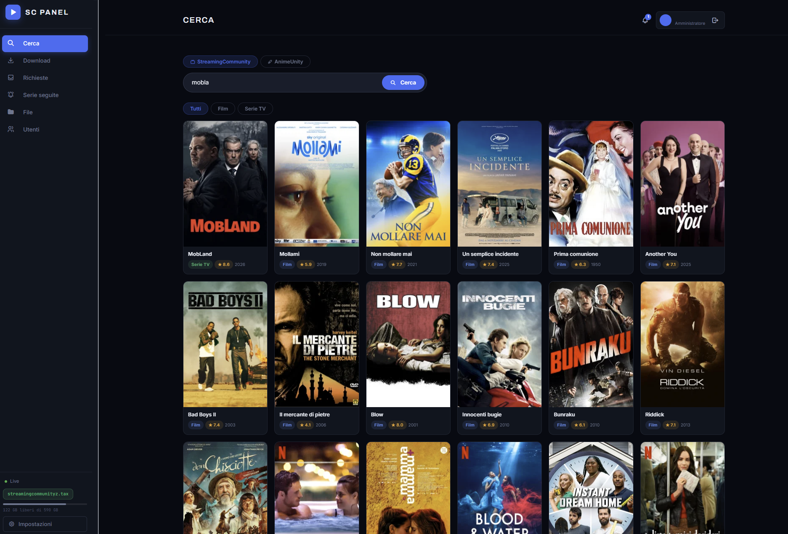
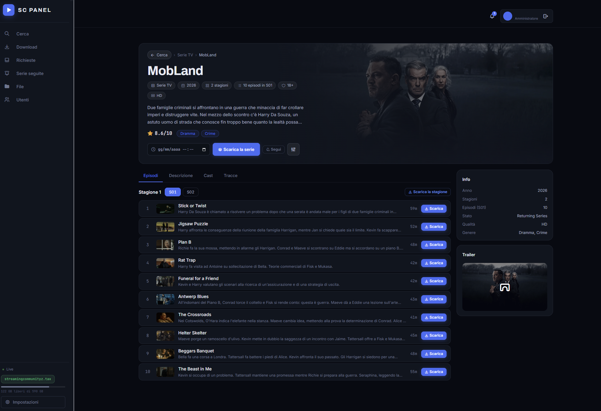
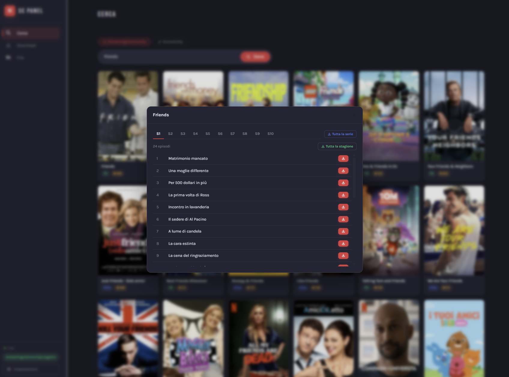
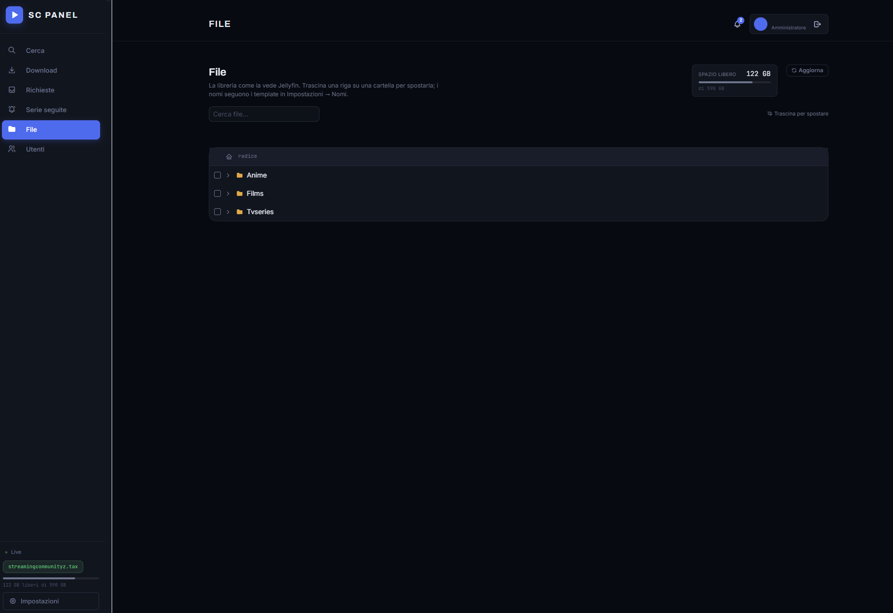
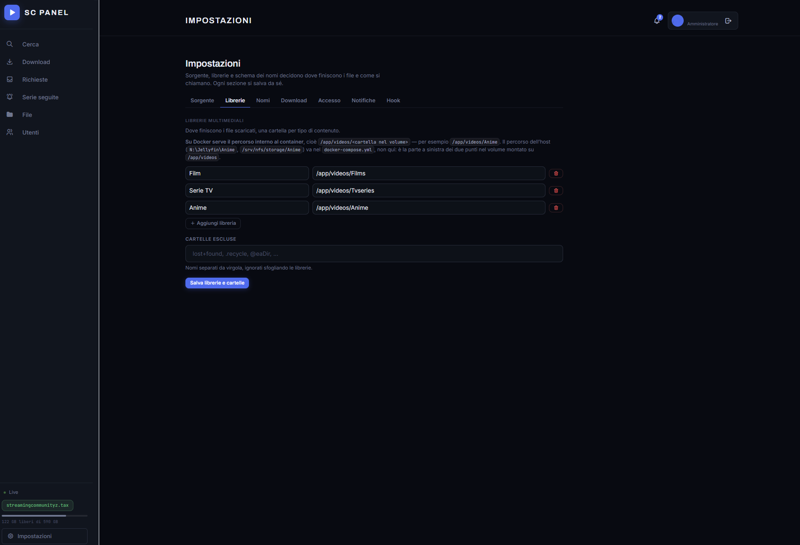

<p align="center">
  
</p>

<p align="center">
  A self-hosted web panel to download films and TV series from the StreamingCommunity platform.<br/>
  Built with FastAPI, real-time progress via SSE, and an integrated file manager.
</p>

---

## Screenshots

<table>
  <tr>
    <td></td>
    <td></td>
  </tr>
  <tr>
    <td></td>
    <td></td>
  </tr>
  <tr>
    <td colspan="2"></td>
  </tr>
</table>

---

## Features

- Search and download films, TV series, and anime
- Automatic quality selection (1080p → 720p → 480p → 360p)
- Parallel HLS segment download with AES-CBC decryption
- Multi-audio track merge via FFmpeg
- Subtitle download (`.vtt`) for non-Italian audio tracks
- Real-time download progress with per-phase steps (video → audio → merge)
- Integrated file manager with drag-and-drop and video streaming
- Jellyfin library path configuration
- Scheduled downloads
- Optional login with Jellyfin credentials — no second account, no local password store
- Independent permissions: download directly, request, approve, manage users, manage settings
- Request queue with approval, preserving the audio and subtitle tracks the requester chose
- Request status on the search result cards, and in-app notifications
- Docker ready

---

## Quick Start

### Docker (recommended)

```bash
curl -O https://raw.githubusercontent.com/EdoardoFiore/StreamingCommunity-downloader/main/docker-compose.template.yml
# Edit the volume paths — create the config one — then:
docker compose -f docker-compose.template.yml up -d
```

The panel is available at `http://localhost:8000`. Set the source domain in **Impostazioni** on first
use: it is not shipped in the image, because it rotates.

The image is published to GitHub Container Registry on every push to `main`:

```
ghcr.io/edoardofiore/streamingcommunity-downloader:latest
```

### From source

```bash
git clone https://github.com/EdoardoFiore/StreamingCommunity-downloader.git
cd StreamingCommunity-downloader
pip install -r requirements.txt
python main.py

pip install -r requirements-dev.txt   # tests only
pytest -q
```

**Prerequisites:** Python ≥ 3.11, FFmpeg.

### Upgrading from v1

v1 is the panel before the Jellyfin login existed. **Pulling the new image changes nothing by
default**: `AUTH_ENABLED` is off unless you set it, so the panel stays as open as it was. You will
see the redesigned interface, and you have to set the source domain once (see above).

To turn the login on, copy the `/app/config` volume and the `DB_FILE` / `DATA_FILE` /
`SCHEDULE_FILE` variables from `docker-compose.template.yml`, then set `AUTH_ENABLED=1`. That volume
is not optional: users, sessions and requests live in `panel.db`, which without it sits inside the
container and is lost on every pull.

To stay on v1, pin the tag instead of following `latest`:

```yaml
image: ghcr.io/edoardofiore/streamingcommunity-downloader:1.0.0
```

If you were running the `-jellyfin` image from the development branch, change the `image:` line to
the main one above — that package is frozen and no longer built. Nothing else changes: the variables
and the `/app/config` volume are the same, so `panel.db` and your users carry over as they are.

---

## Users, roles and requests

With `AUTH_ENABLED=1`, the first sign-in configures the panel and creates its administrator; only a
Jellyfin administrator can do it. After that, Jellyfin accounts **do not** get access automatically —
an administrator imports them from **Utenti** and assigns permissions. Opening the panel to every
Jellyfin account is a switch on that page, off by default.

Permissions are independent flags, not a ladder:

| Permission | Grants |
|---|---|
| `DOWNLOAD` | start and schedule downloads directly |
| `REQUEST` | search and create requests |
| `MANAGE_REQUESTS` | see the queue, approve, deny, fix |
| `MANAGE_USERS` | import users, assign permissions, disable accounts |
| `MANAGE_SETTINGS` | source domain, libraries, performance |
| `MANAGE_FILES` | move, rename and delete in the file manager |
| `VIEW_LIBRARY` | browse and stream the library |

There is deliberately no "admin" flag that implies the rest, so you can have an administrator who
manages settings and users but never sees the request queue.

A user without `DOWNLOAD` sees the same form and the same audio and subtitle checkboxes; the button
says **Richiedi** and creates a request. On approval the source is re-resolved against the current
domain — a dead link or a missing audio track parks the request for a human instead of downloading
the wrong thing. Two people asking for the same content with the same tracks share one download and
are both notified; different audio makes two distinct requests.

### Running without Jellyfin

Leave `AUTH_ENABLED` unset (or `0`) and the panel runs with no login at all: every visitor gets
direct download, settings and the file manager. With `AUTH_ENABLED=1` you get the same result by
pressing **Continua senza Jellyfin** on the setup screen, and can connect Jellyfin later from
**Impostazioni → Accesso e utenti** without a restart.

Going back — from a connected Jellyfin to no login — is deliberately not offered in the UI: the
imported users and their permissions would be left in an ambiguous state.

---

## Configuration

| Variable | Default | Purpose |
|---|---|---|
| `HOST` / `PORT` | `127.0.0.1` / `8000` | bind address |
| `VIDEOS_DIR` | `videos` | download destination |
| `DB_FILE` | `panel.db` | users, sessions, requests — **put this on a persistent volume** |
| `DATA_FILE` | `data.json` | source domain, libraries, performance settings |
| `SCHEDULE_FILE` | `schedule.json` | scheduled downloads |
| `TMP_DIR` | `tmp` | HLS segments while a job runs, cleaned up afterwards |
| `AUTH_ENABLED` | `0` | `1` enables Jellyfin login, requests and users |
| `COOKIE_SECURE` | `0` | set to `1` when serving over HTTPS |
| `COOKIE_SAMESITE` | `lax` | `none` (with `COOKIE_SECURE=1`) only to embed the panel cross-site |
| `TRUST_PROXY_HEADERS` | `0` | set to `1` only behind a reverse proxy you control |

The source domain and the Jellyfin library paths are configurable from **Impostazioni** in the UI.

`panel.db` holds the Jellyfin service API key: keep it out of any web-served directory and off
world-readable storage.

**Run one process.** Download state is held in memory by a single process, so do not add
`--workers` or scale the service — a second replica would neither see nor report on the first's
downloads.

### Embedding as a Jellyfin custom tab

Point an iframe at the panel; nothing else is required. Sign in once inside the tab and stay signed
in — the session lasts **30 days** and renews on every visit, so in practice you log in once and
forget about it.

With Jellyfin and the panel on subdomains of the same domain over HTTPS — say `jf.example.com` and
`request.example.com` — the frame is same-site and the session cookie is sent inside it with the
default `COOKIE_SAMESITE=lax`. On different domains, or different schemes, the frame is cross-site
and a `Lax` cookie is dropped silently: every request inside the frame looks logged out and login
bounces back on itself, which reads as an infinite loop. Either set `COOKIE_SAMESITE=none` together
with `COOKIE_SECURE=1` — browsers reject a `SameSite=None` cookie that is not also `Secure` — or
reverse-proxy the panel under the same site as Jellyfin.

Chromium browsers separately enforce Private Network Access: the Jellyfin page and the panel must
both resolve to public addresses, or both to private ones, from the browser's point of view. Mixing
tiers fails with "the connection was blocked".

`POST /api/auth/jellyfin-token` trades an already-issued Jellyfin access token for a panel session,
for skipping even that one login. It needs a script running on the Jellyfin page, which posts the
token to the frame. Do not put that script in the custom tab HTML: tab content is injected as a
string, so quoting breaks the page, and `<script>` tags inserted that way never execute.

---

## Output structure

```
videos/
├── MovieTitle/
|    └── MovieTitle.mp4
└── SeriesTitle/
    └── Season 01
        ├── S01E01.mp4
        └── S01E02.mp4
```

---

## License

MIT
